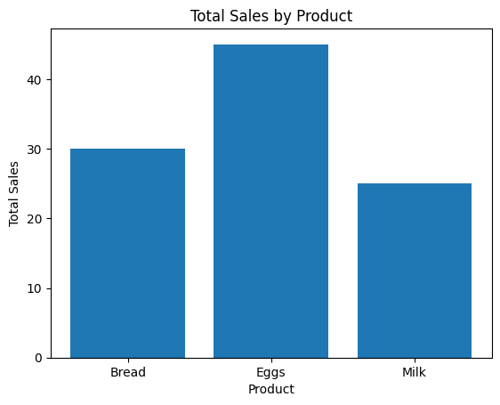
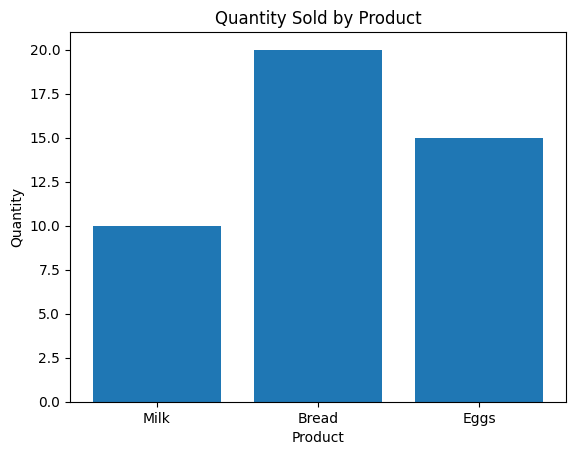

# # 📊 Supermarket Sales Analysis Using Python

## 📌 Project Overview
This project analyzes supermarket sales data using Python. The objective is to calculate total sales, evaluate product performance, and present insights using data visualization.

---

## 🛠 Tools & Technologies
- Python  
- pandas  
- matplotlib  
- Google Colab  

---

## 📂 Dataset
The dataset includes:
- Product  
- Price  
- Quantity  
- Total Sales (calculated)  

---

## 🔄 Steps Performed
- Created a dataset using Python  
- Converted data into a pandas DataFrame  
- Calculated **Total Sales = Price × Quantity**  
- Grouped data by product  
- Sorted products by performance  
- Visualized results using bar charts  

---

## 📊 Key Insights
- 🥇 **Eggs** generated the highest revenue  
- 📦 **Bread** had the highest quantity sold  
- 📉 **Milk** had the lowest performance  

---

## 📈 Visualizations

###  Total Sales by Product

### Quantity Sold by Product

---

## 🧠 What I Learned
- Data manipulation using pandas  
- Creating calculated columns  
- Grouping and aggregating data  
- Sorting and filtering results  
- Building charts using matplotlib  

---

## 👤 Author

**Francis MONNEY**  
Aspiring Data Analyst  

---

## 💬 Project Summary
This project demonstrates my ability to analyze data using Python, transform datasets, and generate insights that support business decision-making. 
